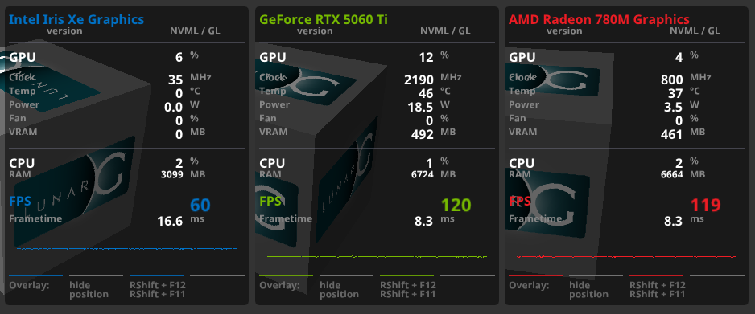
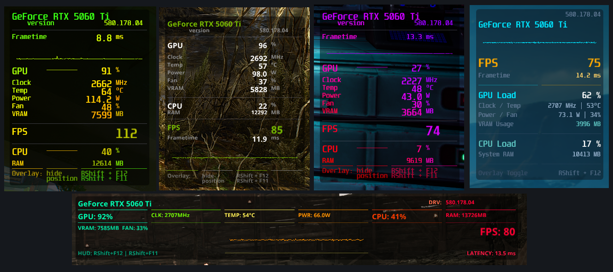

# MangoHud-X

An enhanced fork of [MangoHud](https://github.com/flightlessmango/MangoHud) featuring a fully customizable UI layout engine, window control, per-column opacity, brand color matching, and advanced telemetry styling.

---





## 🚀 Installation

```bash
# Install dependencies (CachyOS / Arch Linux)
#sudo pacman -S --needed meson ninja gcc git cmake vulkan-devel wayland-protocols python-mako spdlog libglvnd libxnvctrl dbus yaml-cpp glew glfw

# Clone and build
git clone https://github.com/DamianKA1993/MangoHud-X.git
cd MangoHud-X
meson setup build --prefix=/usr
ninja -C build
sudo ninja -C build install

# Deploy default config and fonts
mkdir -p ~/.config/MangoHud
cp -r _EXAMPLE/* ~/.config/MangoHud/
```

## Building & Installing 64-bit and 32-bit MangoHud on Arch Linux / CachyOS

Arch Linux and CachyOS do not provide a native `lib32-libcap` package in the official repositories, which causes linker errors during 32-bit builds. Additionally, the default staging paths require adjustments to integrate properly with system loader directories.

Use the steps below to build and install both architectures cleanly.

---

### 1. Install Dependencies

Install required development packages from official repositories and `lib32-libcap` from the AUR:

```bash
# Official multilib & build dependencies
sudo pacman -S --needed \
    gcc-multilib \
    meson \
    ninja \
    glslang \
    lib32-libx11 \
    lib32-libxkbcommon \
    lib32-wayland \
    lib32-libdrm \
    lib32-libglvnd \
    lib32-vulkan-icd-loader \
    xorgproto \
    jre-openjdk

# AUR dependency (required for 32-bit process metrics)
paru -S --needed lib32-libcap
# or: yay -S --needed lib32-libcap
```

### 2. Build Both Architectures
Run the upstream build script with your preferred configuration options:

```bash
# Clean up previous build directories
rm -rf build build32

# Build both 64-bit and 32-bit targets
./build.sh build -Dwith_xnvctrl=disabled
```

### 3. Install to System Directories
Install the compiled binaries to Arch-standard paths (/usr/lib and /usr/lib32) and update the Vulkan implicit layer manifests:

```bash
# 1. Install 64-bit libraries
sudo install -d /usr/lib/mangohud
sudo install -m755 build/release/usr/lib/mangohud/lib64/*.so /usr/lib/mangohud/

# 2. Install 32-bit libraries to /usr/lib32
sudo install -d /usr/lib32/mangohud
sudo install -m755 build/release/usr/lib/mangohud/lib32/*.so /usr/lib32/mangohud/

# 3. Install the mangohud launcher script
sudo install -m755 build/release/usr/bin/mangohud /usr/bin/mangohud

# 4. Copy Vulkan layer manifests and fix staging paths
sudo cp -r build/release/usr/share/vulkan/implicit_layer.d/* /usr/share/vulkan/implicit_layer.d/

sudo sed -i 's|.*/usr/lib/mangohud/lib32|/usr/lib32/mangohud|g' /usr/share/vulkan/implicit_layer.d/MangoHud*.x86.json
sudo sed -i 's|.*/usr/lib/mangohud/lib64|/usr/lib/mangohud|g' /usr/share/vulkan/implicit_layer.d/MangoHud*.x86_64.json

# 5. Create compatibility symlinks for OpenGL loaders
sudo ln -sfn /usr/lib32/mangohud /usr/lib/mangohud/lib32
sudo ln -sfn /usr/lib/mangohud /usr/lib/mangohud/lib64
```
### 4. Verification
Verify that both shared objects are present and target the correct architectures:

```bash
file /usr/lib/mangohud/libMangoHud.so
# Expected: ELF 64-bit LSB shared object

file /usr/lib32/mangohud/libMangoHud.so
# Expected: ELF 32-bit LSB shared object

cat /usr/share/vulkan/implicit_layer.d/MangoHud.x86.json | grep library_path
# Expected: "library_path": "/usr/lib32/mangohud/libMangoHud.so"
```


## What's New in MangoHud-X?

Unlike the upstream project, **MangoHud-X** introduces a complete custom layout engine designed for modular, modern, and highly customized HUD overlays.

* **Custom Layout Engine (`[window]` & `[layout]`):** Define your own layout structure directly via config. Every row (`row`) supports an arbitrary number of columns (`col`)—mix 1, 2, 3, or 4 columns freely within the same configuration with per-element alignment, color, opacity and spacing.
* **Brand Color Auto-Detection (`color = #brand`):** Automatically detects the active GPU vendor (NVIDIA green `#76B900`, AMD red `#ED1C24`, Intel blue `#0071C5`) and applies matching brand colors dynamically.
* **Smart Multi-GPU / eGPU Telemetry Filtering:** Automatically binds telemetry strictly to the actively rendering GPU. Eliminates redundant multi-device clutter (no duplicate `gpu0`/`gpu1` or `vram0`/`vram1` blocks when using hybrid laptops or eGPU configurations).
* **Granular Font & Opacity Control:** Scale specific elements (`font = big`, `font = small`) and adjust per-column transparency (`opacity = 0.5`).
* **Window Styling & Anchoring:** Full control over window rounding, and screen positioning anchors.
* **Fixed Anchor Offsets:** Corrected window offset calculation relative to `bottom` and `right` screen edges for precise and predictable placement.

---

## Initial config that shows possibilities

```bash
# Default MangoHud factory positioning:
position = top-right
offset_x = 200
offset_y = 60
#width=300

gpu_stats
gpu_temp
gpu_core_clock
gpu_power
cpu_stats
gpu_fan
vram


font_file = ~/.config/MangoHud/fonts/NotoSans-Bold.ttf
font_size = 22

[window]
round = 5
background = #00000000

[layout]
row {
    col { text = "{gpu_name}", color = #brand }
    col { text = "", align = right, color = #FFFFFF }
    col { text = "", align = right, color = #888888 }
    col { text = "", align = right, color = #888888 }
}
row {
    col { text = "version", align = right, color = #888888, font = small }
    col { text = "", align = right, color = #FFFFFF }
    col { text = "{driver_version}", align = left, color = #888888, font = small  }
}
row {
    col { text = "separator", color = #FFFFFF, font = small , opacity = 0.0 }
}
separator
row {
    col { text = "separator", color = #FFFFFF, font = small , opacity = 0.0 }
}
row {
    col { text = "GPU", color = #FFFFFF }
    col { text = "", align = right, color = #FFFFFF }
    col { text = "{gpu_load}", align = right, color = #FFFFFF }
    col { text = "%", align = left, color = #888888, font = small }
}
row {
    col { text = "separator", color = #FFFFFF, font = small , opacity = 0.0 }
}
row {
    col { text = "Clock", color = #888888, font = small }
    col { text = "", align = right, color = #FFFFFF }
    col { text = "{gpu_core_clock}", align = right, color = #FFFFFF }
    col { text = "MHz", align = left, color = #888888, font = small }
}
row {
    col { text = "Temp", color = #888888, font = small }
    col { text = "", align = right, color = #FFFFFF }
    col { text = "{gpu_temp}", align = right, color = #FFFFFF }
    col { text = "°C", align = left, color = #888888, font = small }
}
row {
    col { text = "Power", color = #888888, font = small }
    col { text = "", align = right, color = #FFFFFF }
    col { text = "{gpu_power}", align = right, color = #FFFFFF }
    col { text = "W", align = left, color = #888888, font = small }
}
row {
    col { text = "Fan", color = #888888, font = small }
    col { text = "", align = right, color = #FFFFFF }
    col { text = "{gpu_fan}", align = right, color = #FFFFFF }
    col { text = "%", align = left, color = #888888, font = small }
}
row {
    col { text = "VRAM", color = #888888, font = small }
    col { text = "", align = right, color = #FFFFFF }
    col { text = "{vram}", align = right, color = #FFFFFF }
    col { text = "MB", align = left, color = #888888, font = small }
}
row {
    col { text = "separator", color = #FFFFFF, font = small , opacity = 0.0 }
}
separator
row {
    col { text = "separator", color = #FFFFFF, font = small , opacity = 0.0 }
}
row {
    col { text = "CPU", color = #FFFFFF }
    col { text = "", align = right, color = #FFFFFF }
    col { text = "{cpu_stats}", align = right, color = #FFFFFF }
    col { text = "%", align = left, color = #888888, font = small }
}
row {
    col { text = "RAM", color = #888888, font = small }
    col { text = "", align = right, color = #FFFFFF }
    col { text = "{ram}", align = right, color = #FFFFFF, font = small }
    col { text = "MB", align = left, color = #888888, font = small }
}
row {
    col { text = "separator", color = #FFFFFF, font = small , opacity = 0.0 }
}
separator
row {
    col { text = "separator", color = #FFFFFF, font = small , opacity = 0.0 }
}
row {
    col { text = "FPS", color = #brand }
    col { text = "", align = right, color = #FFFFFF }
    col { text = "", align = right, color = #888888 }
    col { text = "{fps}", align = left, color = #brand, font = big }
}
row {
    col { text = "Frametime", color = #888888, font = small }
    col { text = "", align = right, color = #FFFFFF }
    col { text = "{frametime}", align = right, color = #FFFFFF }
    col { text = "ms", align = left, color = #888888, font = small }
}
# Wykres Frametime
row {
    col { text = "{frametime_graph}", color = #brand }
}

row {
    col { type = separator, color = #brand, opacity = 0.8 }
    col { type = separator, color = #888888, opacity = 0.8 }
    col { type = separator, color = #brand, opacity = 0.8 }
    col { type = separator, color = #888888, opacity = 0.8 }
}

row {
    col { text = "Overlay:", color = #888888, font = small, opacity = 0.7 }
    col { text = "hide", align = left, color = #888888, font = small, opacity = 0.7 }
    col { text = "RShift + F12", align = right, color = #888888, font = small, opacity = 0.7 }
    col { text = "", align = left, color = #888888 }
}
row {
    col { text = "", color = #888888, font = small, opacity = 0.7 }
    col { text = "position", align = left, color = #888888, font = small, opacity = 0.7 }
    col { text = "RShift + F11", align = right, color = #888888, font = small, opacity = 0.7 }
    col { text = "", align = left, color = #888888 }
}

```


---

## EXAMPLE dir

In EXAMPLE dir you can find my testing config that will show you usage and possibilities of new layout engine. After instalation just copy files inside EXAMPLE to /home/USER/.config/MangoHud/

* **Included Font:** The example uses *Noto Sans Bold* (`NotoSans-Bold.ttf`), which is licensed under the permissive **SIL Open Font License, Version 1.1 (SIL OFL 1.1)**, allowing free use, modification, and redistribution.

---

## Original Project
For general building instructions, default documentation, dependencies, and upstream features, please refer to the official repository:
👉 **[Original MangoHud Repository](https://github.com/flightlessmango/MangoHud)**

