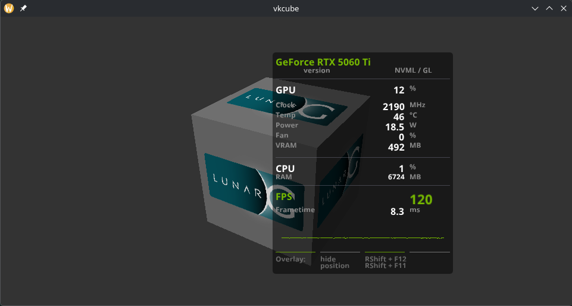
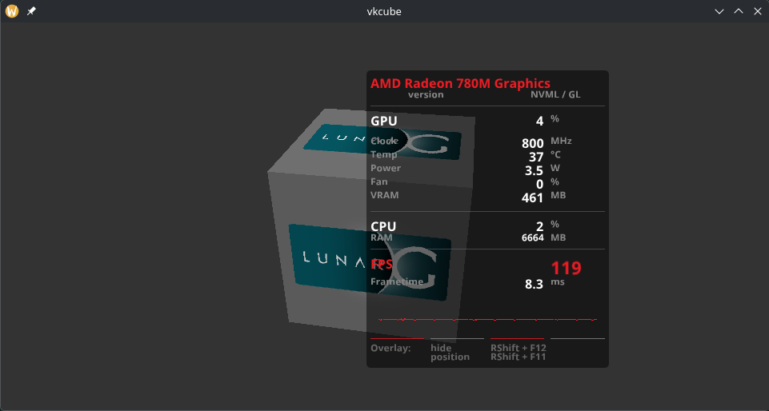
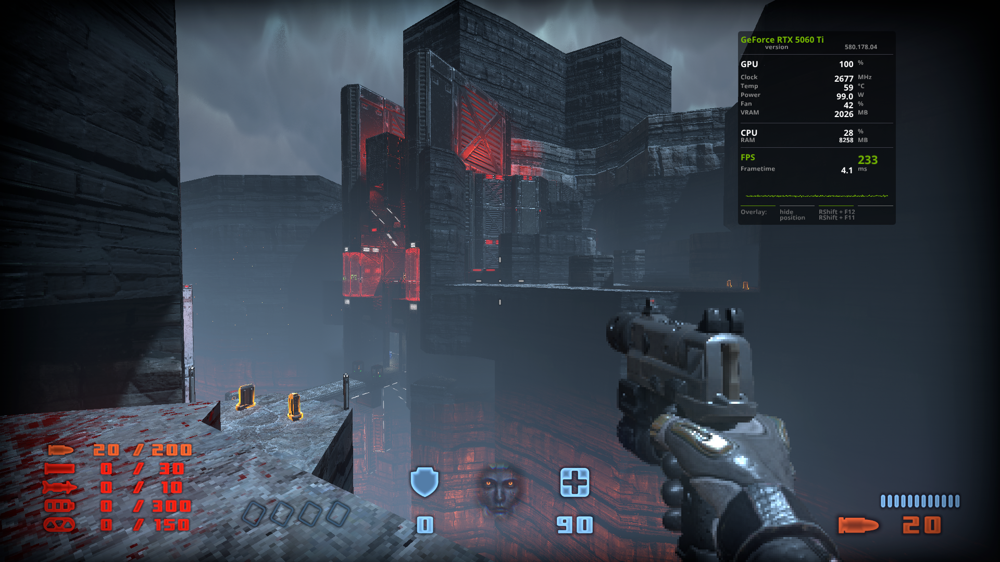

# MangoHud-X

An enhanced fork of [MangoHud](https://github.com/flightlessmango/MangoHud) featuring a fully customizable UI layout engine, window control, per-column opacity, brand color matching, and advanced telemetry styling.

---





## What's New in MangoHud-X?

Unlike the upstream project, **MangoHud-X** introduces a complete custom layout engine designed for modular, modern, and highly customized HUD overlays.

* **Custom Layout Engine (`[window]` & `[layout]`):** Define your own layout structure directly via config, supporting custom rows, columns, alignment, and spacing.
* **Brand Color Auto-Detection (`color = #brand`):** Automatically detects the active GPU vendor (NVIDIA green `#76B900`, AMD red `#ED1C24`, Intel blue `#0071C5`) and applies matching brand colors dynamically.
* **Granular Font & Opacity Control:** Scale specific elements (`font = big`, `font = small`) and adjust per-column transparency (`opacity = 0.5`).
* **Window Styling & Anchoring:** Full control over window rounding, and screen positioning anchors.
* **Fixed Anchor Offsets:** Corrected window offset calculation relative to `bottom` and `right` screen edges for precise and predictable placement.

---

## Initial config that shows posibilities

```bash
# Default MangoHud factory positioning:
position = top-right
offset_x = 200
offset_y = 60

gpu_stats
gpu_temp
gpu_core_clock
gpu_power
cpu_stats
gpu_fan
vram
pci_dev=0000:08:00.0


font_file = /home/damian/.config/MangoHud/fonts/NotoSans-Bold.ttf
font_size = 22

[window]
round = 5
background = #00000000

[layout]
row {
    col { text = "{gpu_name}", color = #brand }
    col { text = "", align = right, color = #FFFFFF }
    col { text = "", align = right, color = #888888 }
    col { text = "", align = right, color = #888888 }
}
row {
    col { text = "version", align = right, color = #888888, font = small }
    col { text = "", align = right, color = #FFFFFF }
    col { text = "{driver_version}", align = left, color = #888888, font = small  }
}
row {
    col { text = "separator", color = #FFFFFF, font = small , opacity = 0.0 }
}
separator
row {
    col { text = "separator", color = #FFFFFF, font = small , opacity = 0.0 }
}
row {
    col { text = "GPU", color = #FFFFFF }
    col { text = "", align = right, color = #FFFFFF }
    col { text = "{gpu_load}", align = right, color = #FFFFFF }
    col { text = "%", align = left, color = #888888, font = small }
}
row {
    col { text = "separator", color = #FFFFFF, font = small , opacity = 0.0 }
}
row {
    col { text = "Clock", color = #888888, font = small }
    col { text = "", align = right, color = #FFFFFF }
    col { text = "{gpu_core_clock}", align = right, color = #FFFFFF }
    col { text = "MHz", align = left, color = #888888, font = small }
}
row {
    col { text = "Temp", color = #888888, font = small }
    col { text = "", align = right, color = #FFFFFF }
    col { text = "{gpu_temp}", align = right, color = #FFFFFF }
    col { text = "°C", align = left, color = #888888, font = small }
}
row {
    col { text = "Power", color = #888888, font = small }
    col { text = "", align = right, color = #FFFFFF }
    col { text = "{gpu_power}", align = right, color = #FFFFFF }
    col { text = "W", align = left, color = #888888, font = small }
}
row {
    col { text = "Fan", color = #888888, font = small }
    col { text = "", align = right, color = #FFFFFF }
    col { text = "{gpu_fan}", align = right, color = #FFFFFF }
    col { text = "%", align = left, color = #888888, font = small }
}
row {
    col { text = "VRAM", color = #888888, font = small }
    col { text = "", align = right, color = #FFFFFF }
    col { text = "{vram}", align = right, color = #FFFFFF }
    col { text = "MB", align = left, color = #888888, font = small }
}
row {
    col { text = "separator", color = #FFFFFF, font = small , opacity = 0.0 }
}
separator
row {
    col { text = "separator", color = #FFFFFF, font = small , opacity = 0.0 }
}
row {
    col { text = "CPU", color = #FFFFFF }
    col { text = "", align = right, color = #FFFFFF }
    col { text = "{cpu_stats}", align = right, color = #FFFFFF }
    col { text = "%", align = left, color = #888888, font = small }
}
row {
    col { text = "RAM", color = #888888, font = small }
    col { text = "", align = right, color = #FFFFFF }
    col { text = "{ram}", align = right, color = #FFFFFF, font = small }
    col { text = "MB", align = left, color = #888888, font = small }
}
row {
    col { text = "separator", color = #FFFFFF, font = small , opacity = 0.0 }
}
separator
row {
    col { text = "separator", color = #FFFFFF, font = small , opacity = 0.0 }
}
row {
    col { text = "FPS", color = #brand }
    col { text = "", align = right, color = #FFFFFF }
    col { text = "", align = right, color = #888888 }
    col { text = "{fps}", align = left, color = #brand, font = big }
}
row {
    col { text = "Frametime", color = #888888, font = small }
    col { text = "", align = right, color = #FFFFFF }
    col { text = "{frametime}", align = right, color = #FFFFFF }
    col { text = "ms", align = left, color = #888888, font = small }
}
# Wykres Frametime
row {
    col { text = "{frametime_graph}", color = #brand }
}

row {
    col { type = separator, color = #brand, opacity = 0.8 }
    col { type = separator, color = #888888, opacity = 0.8 }
    col { type = separator, color = #brand, opacity = 0.8 }
    col { type = separator, color = #888888, opacity = 0.8 }
}

row {
    col { text = "Overlay:", color = #888888, font = small, opacity = 0.7 }
    col { text = "hide", align = left, color = #888888, font = small, opacity = 0.7 }
    col { text = "RShift + F12", align = right, color = #888888, font = small, opacity = 0.7 }
    col { text = "", align = left, color = #888888 }
}
row {
    col { text = "", color = #888888, font = small, opacity = 0.7 }
    col { text = "position", align = left, color = #888888, font = small, opacity = 0.7 }
    col { text = "RShift + F11", align = right, color = #888888, font = small, opacity = 0.7 }
    col { text = "", align = left, color = #888888 }
}

```



---

## EXAMPLE dir

In EXAMPLE dir you can find my testing config that will show you usage and posibilities of new layout engine. After instalation just copy files inside EXAMPLE to /home/USER/.config/MangoHud/

* **Included Font:** The example uses *Noto Sans Bold* (`NotoSans-Bold.ttf`), which is licensed under the permissive **SIL Open Font License, Version 1.1 (SIL OFL 1.1)**, allowing free use, modification, and redistribution.

---

## Original Project
For general building instructions, default documentation, dependencies, and upstream features, please refer to the official repository:
👉 **[Original MangoHud Repository](https://github.com/flightlessmango/MangoHud)**

